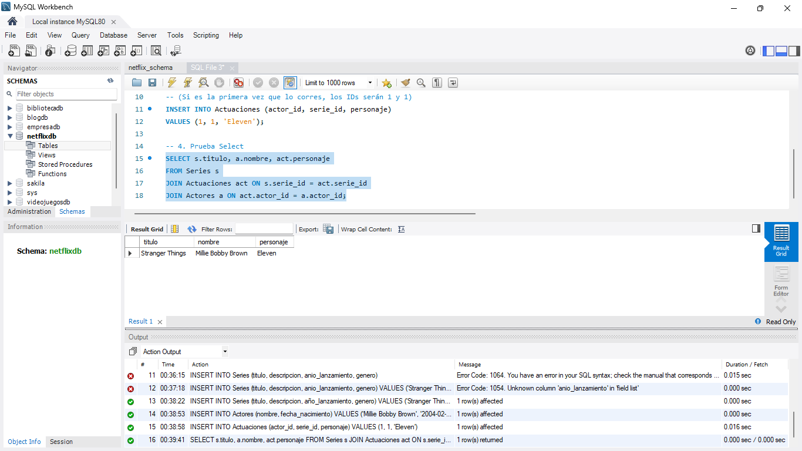
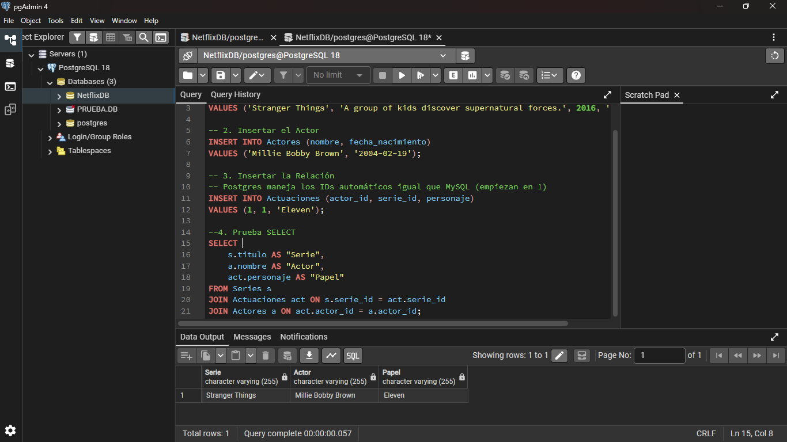
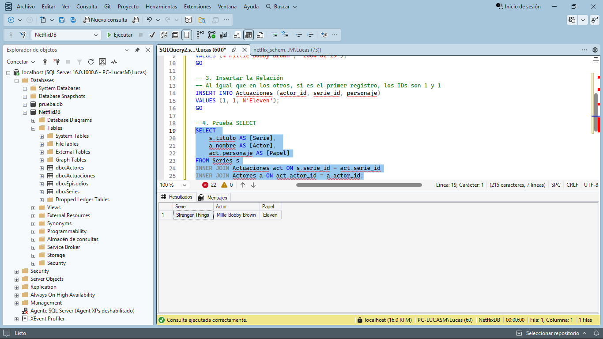

# SQL RDBMS Cross-Compatibility Lab 🚀

A comprehensive technical laboratory demonstrating the portability and adaptation of a relational database schema across the world's most popular SQL engines: **MySQL**, **PostgreSQL**, and **Microsoft SQL Server (T-SQL)**.

## 📌 Project Overview
The core objective of this project was to design a normalized database for a streaming service (Netflix-inspired) and implement it successfully in three different environments. This involved translating Data Definition Language (DDL) and Data Manipulation Language (DML) scripts to handle specific dialect requirements.

### Data Model (Schema)
* **Series:** Primary catalog of shows.
* **Episodes:** One-to-Many relationship with Series.
* **Actors:** Independent entity for performer data.
* **Actuaciones:** Many-to-Many junction table (Bridge) connecting Actors and Series.

---

## 🛠 Tech Stack & Tools
* **MySQL:** Managed via *MySQL Workbench*.
* **PostgreSQL:** Managed via *pgAdmin 4*.
* **SQL Server (T-SQL):** Managed via *SQL Server Management Studio (SSMS)*.
* **Version Control:** Git & GitHub.

---

## 🔄 Porting & Dialect Comparison

| Feature | MySQL | PostgreSQL | SQL Server (T-SQL) |
| :--- | :--- | :--- | :--- |
| **Identity/Auto-Inc** | `AUTO_INCREMENT` | `SERIAL` (Sequences) | `IDENTITY(1,1)` |
| **String Types** | `VARCHAR` / `TEXT` | `VARCHAR` / `TEXT` | `NVARCHAR` / `NVARCHAR(MAX)` |
| **Unicode Support** | Charset `utf8mb4` | Native UTF-8 | `N` Prefix (National) |
| **Batch Separator** | `;` (Standard) | `;` (Standard) | `GO` Keyword |
| **Case Sensitivity** | Non-sensitive (usually) | Strict (Folded to lower) | Non-sensitive (default) |

---

## 📸 Proof of Work (Screenshots)

### 1. MySQL Implementation
Demonstrating the use of standard `INT AUTO_INCREMENT` and relational integrity.
* **Schema Setup:** 
* **Query Results:** 

### 2. PostgreSQL Implementation
Adapted for `SERIAL` data types and strict schema handling in pgAdmin.
* **Schema Setup:** 
* **Query Results:** 

### 3. SQL Server (T-SQL) Implementation
Utilizing `IDENTITY` columns and `NVARCHAR` for professional-grade Unicode support.
* **Schema Setup:** 
* **Query Results:** 

---

## 🧪 Testing Query
The following cross-compatible JOIN query was used to validate data integrity across all engines:

```sql
SELECT 
    s.titulo AS [Series_Title], 
    a.nombre AS [Actor_Name], 
    act.personaje AS [Role]
FROM Series s
JOIN Actuaciones act ON s.serie_id = act.serie_id
JOIN Actores a ON act.actor_id = a.actor_id;
